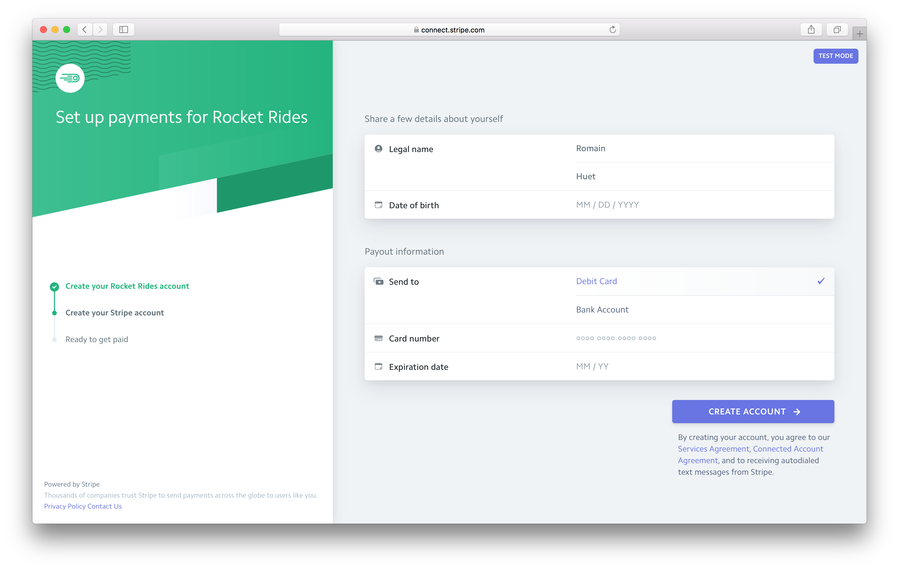

# Rocket Rides: Stripe Connect Demo

Rocket Rides is a fictitious on-demand platform that offers customers rides on rockets with pilots, built on top of [Stripe Connect](https://stripe.com/connect).

**You can try Rocket Rides live on [rocketrides.io](https://rocketrides.io).**

## Overview

Rocket Rides showcases how to sign up pilots and use [Connect Express accounts](https://stripe.com/connect/account-types) for them to get paid. It uses pre-built UI components to be up and running quickly and customize the user experience.

This platform uses the Stripe API to create payments for pilots, fetch their available and pending balance, and let them view transfers. It also creates instant payouts for pilots to be paid immediately to a debit card.

To integrate Stripe Connect in your own app, check out [server/pilots/stripe.js](server/routes/pilots/stripe.js) to see how to easily create Connect Express accounts and interact with the Stripe API. You can also look at [server/pilots/pilots.js](server/routes/pilots/stripe.js) to see how to create payments going straight to pilots.

## Requirements

You'll need a Stripe account to manage pilot onboarding and payments. [Sign up for free](https://dashboard.stripe.com/register), then [enable Connect](https://dashboard.stripe.com/account/applications/settings) by filling in your Platform Settings. In the Development section, take note of your `client_id`, and enter the following in the Redirect URIs field: `http://localhost:3000/pilots/stripe/token`.

For instant payouts to work, you'll need to [turn off automatic payouts](https://dashboard.stripe.com/account/payouts) in your settings.

You'll need to have [Node](http://nodejs.org) >= 7.x and [MongoDB](http://mongodb.org) installed to run this app.

## Getting Started

Install dependencies using npm (or yarn):

    npm install

Copy the configuration file and add your own [Stripe API keys](https://dashboard.stripe.com/account/apikeys) and [client ID](https://dashboard.stripe.com/account/applications/settings):

    cp config.default.js config.js

Make sure MongoDB is running. If you're using Homebrew on OS X:

    brew services start mongodb

Run the app:

    npm start

Go to http://localhost:3000 in your browser to start using the app.

## iOS App

There's also a Rocket Rides iOS demo app available in the `ios/` subdirectory.

Follow the `README.md` in that folder to try it out!

## Credits

* Code: [Romain Huet](https://twitter.com/romainhuet)
* Design: [Bill Labus](https://twitter.com/billlabus)
* Logos: [Focus Lab](https://thenounproject.com/term/comet/547848/) and [Luis Prado](https://thenounproject.com/term/jet-pack/17210/) (The Noun Project)
