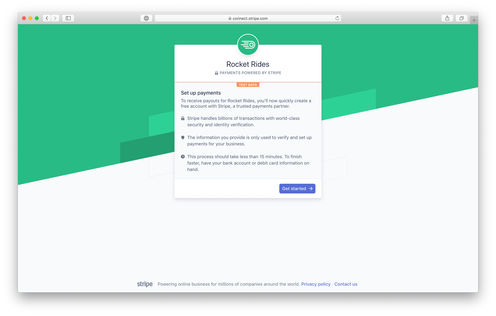

# Rocket Rides: Stripe Connect Demo

Rocket Rides is a sample on-demand platform that offers passengers rides with pilots, built on top of [Stripe Connect](https://stripe.com/connect) and the [Stripe iOS SDK](https://stripe.com/docs/mobile/ios).

**You can try the web app live on [rocketrides.io](https://rocketrides.io).**

This repository contains two components:
* [Web server in Node.js](#web-onboarding-for-pilots) to onboard pilots on the web and get them paid
* [iOS app in Swift](#ios-app-for-passengers) for passengers to request and pay for rides

## Web Onboarding for Pilots

Rocket Rides showcases how to sign up pilots and use [Connect Express accounts](https://stripe.com/connect/account-types) for them to get paid. It uses pre-built UI components to be up and running quickly and customize the user experience.

This platform uses the Stripe API to create payments for pilots, fetch their available and pending balance, and let them view transfers. It also creates instant payouts for pilots to be paid immediately to a debit card.

To integrate Stripe Connect in your own app, check out these two files in particular:
1. [`server/routes/pilots/stripe.js`](server/routes/pilots/stripe.js) shows how to easily create Connect Express accounts and interact with the Stripe API.
2. [`server/routes/pilots/pilots.js`](server/routes/pilots/pilots.js) shows how to create payments going straight to pilots.

### Requirements

You'll need a Stripe account to manage pilot onboarding and payments. [Sign up for free](https://dashboard.stripe.com/register), then [enable Connect](https://dashboard.stripe.com/account/applications/settings) by filling in your Platform Settings. In the Development section, take note of your `client_id`, and enter the following in the Redirect URIs field: `http://localhost:3000/pilots/stripe/token`.

For instant payouts to work, you'll need to [turn off automatic payouts](https://dashboard.stripe.com/account/payouts) in your settings.

You'll need to have [Node.js](http://nodejs.org) >= 7.x and [MongoDB](http://mongodb.org) installed to run this app.

### Getting Started

Install dependencies using npm (or yarn):

    cd server
    npm install

Copy the configuration file and add your own [Stripe API keys](https://dashboard.stripe.com/account/apikeys) and [client ID](https://dashboard.stripe.com/account/applications/settings):

    cp config.default.js config.js

Make sure MongoDB is running. If you're using Homebrew on macOS:

    brew services start mongodb

Run the app:

    npm start

Go to http://localhost:3000 in your browser to start using the app.

## iOS App for Passengers

The Rocket Rides iOS app is written in Swift and is built using the [Stripe iOS SDK](https://github.com/stripe/stripe-ios) to accept both card payments and Apple Pay.

### Requirements

This project is written in Swift and requires Xcode 8 to build and run, and [CocoaPods](https://guides.cocoapods.org/using/getting-started.html) to install the dependencies. The app is compatible with iOS 10.0+. You can use it both the iOS Simulator or on your iPhone.

### Getting Started

To get started, install the dependencies using CocoaPods:

    cd ios
    pod install

Open `RocketRides.xcworkspace` (not `RocketRides.xcodeproj`) in Xcode. Build and run the app!

To try out the full payment experience, run the server locally as described above, then follow these steps:

1. Create a new pilot using the Rocket Rides web onboarding.
2. Fill in the `publishableKey` property in `AppDelegate.swift`. You can find your publishable key in your [Stripe Dashboard](https://dashboard.stripe.com/account/apikeys).
3. Fill in the `baseURLString` property in `AppDelegate.swift`. This should be `http://localhost:3000` if you haven't modified the server configuration.
4. Relaunch the app! Tapping on "Payment" and "Price" should now work.
5. Enter a destination, your payment option, and request a ride! You should see the payment in your Stripe Dashboard.

## Credits

* Code: [Romain Huet](https://twitter.com/romainhuet) and [Joey Dong](https://twitter.com/joeydong_)
* Design: [Bill Labus](https://twitter.com/billlabus)
* Logos: [Focus Lab](https://thenounproject.com/term/comet/547848/) and [Luis Prado](https://thenounproject.com/term/jet-pack/17210/) (The Noun Project)
