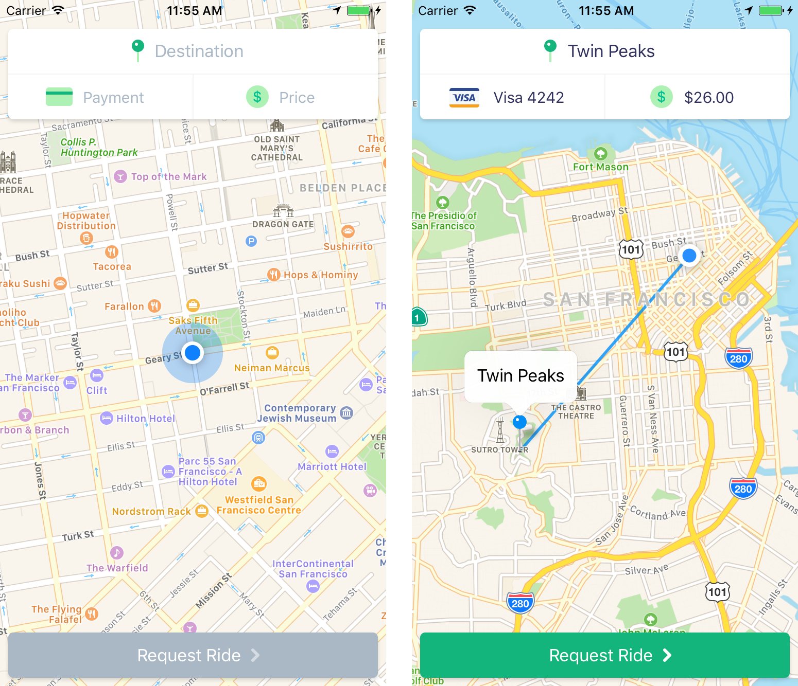

# Rocket Rides iOS App

This directory contains the source code for the Rocket Rides iOS app. The app is written in Swift and is built using the [Stripe iOS SDK](https://github.com/stripe/stripe-ios).

Rocket Rides takes inspiration from popular ride-sharing apps such as Uber and Lyft to illustrate how to build an on-demand marketplace using the [Stripe Connect](https://stripe.com/connect) payments platform. The app also accepts both card and Apple Pay payments seamlessly using the [Stripe iOS SDK](https://github.com/stripe/stripe-ios).

## Getting Started

To get started quickly, follow these simple steps:

1. Clone this repository and open `RocketRides.xcodeproj` in Xcode

2. Launch the app!

To try out the full payment experience, you will need to:

1. Sign up for a [Stripe](https://stripe.com/) account if you don't already have one

2. Fill in the `publishableKey` property in `AppDelegate.swift`

  > This can be either your test or live publishable key. The key should begin with "pk_". You can find your publishable key in the [Stripe Dashboard](https://dashboard.stripe.com/account/apikeys) after you've
     signed up for an account.

3. Follow the [Rocket Rides backend setup steps](https://github.com/stripe/stripe-connect-rocketrides)

4. Create a new pilot using the Rocket Rides web page

5. Fill in the `baseURLString` property in `AppDelegate.swift`

  > This should be "http://localhost:3000" if you're running the Rocket Rides backend locally.

6. Relaunch the app!

  > Tapping on "Payment" and "Price" should work now. Then you can request a ride!
